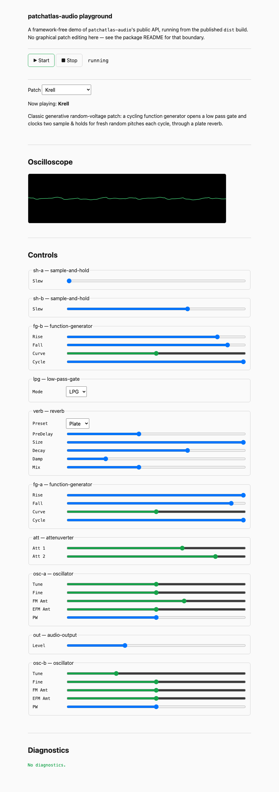

# patchatlas-audio

A small, dependency-free Web Audio engine for modular-synth-style patches. You describe a
patch as plain JSON — modules and cable connections, addressed by name — and the package
compiles it, runs it in a single `AudioWorklet`, and hands you back an `AudioNode` you can
route however you like.

It ships 26 module kernels (oscillators, filters, envelopes, sequencers, a reverb, logic,
sample & hold, and more) as pure, allocation-free TypeScript — no native Web Audio node graph
under the hood, and no framework dependency. See
[`examples/playground`](examples/playground) for a runnable demo built entirely on the
public API described here, and [`docs/architecture.md`](docs/architecture.md) for how the
compile → interpret → worklet pipeline fits together.

<p align="center">
  
</p>

**Demo:** the screenshot above is `examples/playground` running the Krell preset locally. Try it
live at **https://fedemendex.github.io/patchatlas-audio/**.

## Install

```sh
npm install patchatlas-audio
```

Two entry points ship in `dist`, resolved through the package's `exports` map — never import
from `src`:

* `patchatlas-audio` — the main API (`createEngine`, `validate`, `compilePatch`, module
  definitions, param curve helpers).
* `patchatlas-audio/worklet.js` — a fully self-contained `AudioWorklet` processor bundle. You
  never import this directly; you point `createEngine` at its URL (see below).

## Minimal example

```ts
import { createEngine, type Patch } from "patchatlas-audio";

const patch: Patch = {
  modules: [
    { id: "osc", type: "oscillator" },
    { id: "out", type: "audio-output" },
  ],
  connections: [
    { from: ["osc", "Sine"], to: ["out", "L In"] },
    { from: ["osc", "Sine"], to: ["out", "R In"] },
  ],
};

const context = new AudioContext();
const engine = await createEngine(context);

engine.output.connect(context.destination);
engine.load(patch);

// Start must run inside a user gesture handler (browser autoplay policy).
startButton.addEventListener("click", async () => {
  await context.resume();
  engine.start();
});
```

Module and param names are the registry's stable identifiers — call
`getModuleDefinitions()` to enumerate every playable module and its jack/param shape, and
`getModuleDefinition(slug)` to look up one. Param values in a `Patch` are always **engine
units** (e.g. Hz for a filter cutoff), never a normalized 0..1 knob position — see
[`docs/signals.md`](docs/signals.md) for the full voltage/unit convention every kernel
follows. The exported curve helpers (`normalizedToEngineValue`, `engineValueToNormalized`,
`defaultNormalizedValue`, `isBipolarParam`) convert between a UI's 0..1 control position and
engine units for you; `examples/playground/src/controls.ts` uses all four to build real knobs
and switches from a `ParamSpec`.

Call `validate(patch, definitions)` for pure, audio-free structural diagnostics before you
ever touch an `AudioContext`, and inspect `engine.load(patch).diagnostics` for the same
structured `Diagnostic[]` after a live load — each diagnostic carries a stable `code`, a
`severity`, and whether the offending module/jack/param/connection was dropped. Loading is
lenient (an unresolvable connection is dropped, not a thrown error) except when a patch is
structurally ambiguous — e.g. two modules sharing an `id` that a connection references — in
which case `loaded` is `false` and nothing is loaded.

## `AudioContext` ownership

**You create and own the `AudioContext`** — its `resume()`, `suspend()`, and `close()` calls
are entirely your responsibility. The engine never touches `context.destination` and never
suspends or closes a context it did not create, so several engines can safely share one
context. The engine owns everything on its side of `engine.output`: worklet loading, the
underlying `AudioWorkletNode`, graph compilation and messaging, transport state, and cleanup
of its own nodes and listeners via `dispose()`.

You own all routing:

```ts
engine.output.connect(context.destination);
engine.output.connect(analyser); // your own AnalyserNode, recorder, effect, ...
```

`engine.output` is typed as `AudioNode`, not the concrete `AudioWorkletNode` — treat it
opaquely.

## The `workletUrl` override

By default, `createEngine`'s worklet URL is resolved relative to the package's own built
`dist/index.js` (`new URL("./worklet.js", import.meta.url)`), so `import "patchatlas-audio"`
just works with zero configuration under most bundlers.

Some setups need to point at a different copy of `worklet.js` explicitly — a bundler that
doesn't bundle npm dependencies and needs an import map (as `examples/playground` does), a
CDN deployment, or a CSP that requires a specific origin for worker/worklet scripts:

```ts
const workletUrl = new URL("./patchatlas-audio-worklet.js", import.meta.url).href;
const engine = await createEngine(context, { workletUrl });
```

Whatever URL you pass must point at an unmodified copy of the package's own
`dist/worklet.js` — it is a single, fully self-contained bundle (no `import` statements,
verified at build time) that calls `registerProcessor` for you.

## Extending the engine

The engine ships with a registry of built-in kernels.

Contributors can add a new built-in kernel by implementing the internal
`Kernel<S>` contract, registering it in `src/modules/registry.ts`, and adding
the required DSP and registry tests. See
[`docs/adding-a-kernel.md`](docs/adding-a-kernel.md).

Package consumers cannot register third-party kernels at runtime.
`Kernel<S>`, `ModuleDSP`, and the registry are internal and are not exported as
part of the public API.

## More

* [`docs/architecture.md`](docs/architecture.md) — the compile → interpret → worklet pipeline,
  the one-block feedback model, and the allocation-free `process()` contract every kernel
  follows.
* [`docs/signals.md`](docs/signals.md) — the normative voltage/signal-range standard.
* [`docs/kernel-checklist.md`](docs/kernel-checklist.md) — the review checklist every kernel
  PR must satisfy (useful context if you're reading the source, even though third-party
  kernels aren't pluggable yet).

## License

MIT — see [`LICENSE`](LICENSE). The Dattorro reverb kernel (`src/modules/reverb.ts`) adapts
public-domain code from
[khoin/DattorroReverbNode](https://github.com/khoin/DattorroReverbNode); its upstream notice
is reproduced in that file and in the vendored test fixture.
