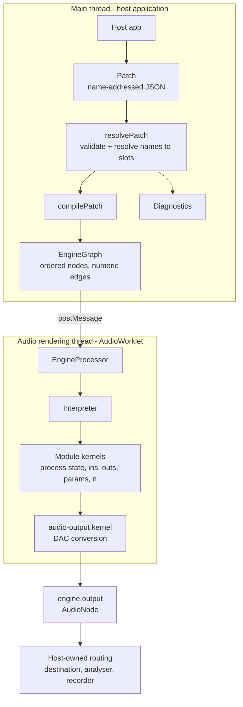

# Architecture

How `patchatlas-audio` turns a plain JSON `Patch` into sound, and where the seams are.

Read this before changing engine or kernel code. If you are adding a module kernel, read
[`adding-a-kernel.md`](adding-a-kernel.md) next; if you are writing kernel DSP,
[`signals.md`](signals.md) is the normative unit standard and
[`kernel-checklist.md`](kernel-checklist.md) is the review gate.

---

## Architecture at a glance

* **Language:** TypeScript, ESM only. No runtime dependencies —
  [`package.json`](../package.json) has no `dependencies` field at all, and everything under
  `devDependencies` is build or test tooling.
* **Build:** [`tsdown`](https://tsdown.dev) (Rolldown under the hood), configured in
  [`tsdown.config.ts`](../tsdown.config.ts). Two independent build configs, not one
  multi-entry config — see [Build and delivery](#build-and-delivery).
* **Tests:** Vitest, in a **Node** environment with `globals: false`
  ([`vitest.config.ts`](../vitest.config.ts)). That choice is load-bearing — it is what keeps
  the DSP half genuinely browser-independent (below) rather than merely asserted in a
  comment. Tests that do need Web Audio types, like `session.test.ts`, mock them explicitly.
* **Browser verification:** [`examples/playground`](../examples/playground) is a real
  consumer of the built package, and its Playwright suite drives headless Chromium and
  RMS-probes a genuine `AnalyserNode` fed by the built worklet bundle. `scripts/smoke.mjs`
  additionally drives the *built* processor under Node with stubbed worklet globals.
* **Shape:** one main-thread bundle (`dist/index.js`) plus one fully self-contained
  `AudioWorklet` bundle (`dist/worklet.js`).
* **DSP model:** every module is a pure TypeScript **kernel** operating on `Float32Array`
  buffers inside a single `AudioWorkletProcessor`. There is no native `AudioNode` per module.
  Native Web Audio is confined to plumbing: the host's `AudioContext`, one `AudioWorkletNode`,
  and whatever the host connects downstream of `engine.output`.

### What is browser-independent, and what isn't

The package is not browser-free end to end, and it isn't meant to be — it targets Web Audio.
The split is deliberate and worth knowing before you edit anything:

| Browser-independent (plain TypeScript, runs under Node) | Browser-bound |
| --- | --- |
| the patch schema, `resolvePatch`/`validate`, `compilePatch`, graph ordering ([`engine/patch.ts`](../src/engine/patch.ts), [`diagnostics.ts`](../src/engine/diagnostics.ts), [`compile.ts`](../src/engine/compile.ts), [`graph.ts`](../src/engine/graph.ts)) | [`engine/session.ts`](../src/engine/session.ts) — `AudioContext`, `AudioWorkletNode`, `audioWorklet.addModule` |
| the `Interpreter` and every module kernel ([`engine/interpreter.ts`](../src/engine/interpreter.ts), [`modules/`](../src/modules)) | [`worklet/`](../src/worklet) — `AudioWorkletProcessor`, `registerProcessor`, the `sampleRate` global |
| param curves and unit constants ([`params.ts`](../src/engine/params.ts), [`units.ts`](../src/engine/units.ts)) | |

That is what makes the numeric DSP tests possible: the compiler and the render loop can be
driven directly from Vitest with no DOM, no `AudioContext`, and no mocking. Only the two
plumbing layers need a browser (or, in `scripts/smoke.mjs`, stubbed worklet globals).

Why a single worklet instead of a native node graph: modular patches are dense, cyclic, and
re-patched live. A per-module `AudioNode` graph would make deterministic ordering, one-block
feedback, and per-sample CV behaviour the browser's business rather than ours. Owning the
inner loop means the same code renders identically under Vitest in Node and in the browser.

---

## Repository map

| Path | Responsibility |
| --- | --- |
| [`src/index.ts`](../src/index.ts) | **The public TypeScript API.** The one file that defines the names the package commits to supporting; nothing else under `src/` is importable by consumers. (The package's other public artifact is `dist/worklet.js` — see [Build and delivery](#build-and-delivery).) |
| [`src/engine/`](../src/engine) | Compiler and runtime internals: patch schema, resolution/diagnostics, graph ordering, the interpreter, param curves, unit constants, and the browser-facing `createEngine` session. |
| [`src/modules/`](../src/modules) | DSP implementations — one kernel per file — plus [`registry.ts`](../src/modules/registry.ts) (the closed slug → kernel binding) and [`definitions.ts`](../src/modules/definitions.ts) (the kernel-free public projection of it). |
| [`src/worklet/`](../src/worklet) | Browser plumbing: the `AudioWorkletProcessor` shell and the typed main-thread ↔ worklet message protocol. |
| [`examples/playground/`](../examples/playground) | A runnable demo built **only** on the public API, and the package's browser-integration test bed. Its own npm workspace with its own build, unit and e2e tests. |
| [`docs/`](.) | This file, the signal standard, the kernel checklist, and the contributor guide. |
| [`scripts/`](../scripts) | Build and release assertions: `verify-worklet-bundle.mjs` (the worklet bundle contains no `import`/`require`) and `smoke.mjs` (the built `dist` renders audio through the package's own `exports` map). |

Public contracts live in `src/index.ts`. Compiler/runtime internals live in `src/engine/`.
DSP lives in `src/modules/`. Browser plumbing lives in `src/worklet/`.

The package has **two** public artifacts, both reached through the `exports` map in
`package.json`: the TypeScript API (`dist/index.js` / `dist/index.d.ts`, built from
`src/index.ts`) and the worklet bundle (`dist/worklet.js`, built from `src/worklet.ts`). The
worklet is public in the sense that consumers may resolve and host its URL — its *contents*,
and the message protocol it speaks, are internal and can change at any time.

Two boundary tests keep those lines honest: [`src/boundary.test.ts`](../src/boundary.test.ts)
(no host-application imports reach into the engine) and
[`examples/playground/src/boundary.test.ts`](../examples/playground/src/boundary.test.ts)
(every playground import resolves to the bare `patchatlas-audio` specifier, never a deep
`dist/` or `src/` path). [`src/publicSurface.test.ts`](../src/publicSurface.test.ts) snapshots
the exported surface, so an accidental addition or removal fails CI.

---

## Vocabulary

| Name | Where | Public? | What it is |
| --- | --- | --- | --- |
| `Patch` | [`engine/patch.ts`](../src/engine/patch.ts) | **public** | The input format: plain, name-addressed JSON. `{ modules, connections }`. |
| `PatchModule` | `engine/patch.ts` | **public** | One module instance: caller-chosen `id`, registry `type` slug, optional `params` in engine units. |
| `PatchConnection` | `engine/patch.ts` | **public** | One cable: `from: [moduleId, outJackName]`, `to: [moduleId, inJackName]`. Direction is implied by position, not stored as a flag. |
| `ModuleDefinition` | [`modules/definitions.ts`](../src/modules/definitions.ts) | **public** | The kernel-free description of a module: `slug`, `inJacks`, `outJacks`, `params`, and optional `audioOutput` / `reportsStep` / `limitations`. What a UI needs to draw a panel. |
| `ParamSpec` | [`engine/kernel.ts`](../src/engine/kernel.ts) | **public** | One control's `min`/`max`/`default`/`curve` (+ `positions` for switches). |
| `EngineGraph` | [`engine/graph.ts`](../src/engine/graph.ts) | **public** | The compiled form: nodes in deterministic processing order, numeric `[nodeIndex, slot]` edges, and the indices of audio-output nodes. |
| `Diagnostic` | [`engine/diagnostics.ts`](../src/engine/diagnostics.ts) | **public** | A structured, machine-readable report of something the compiler dropped or flagged. |
| `Engine` | [`engine/session.ts`](../src/engine/session.ts) | **public** | The browser runtime handle returned by `createEngine`: `output`, `load`, `setParam`, `start`, `stop`, `onSteps`, `dispose`. |
| `ModuleDSP` | [`modules/registry.ts`](../src/modules/registry.ts) | *internal* | A registry entry: everything in `ModuleDefinition` **plus** the `kernel`. `ModuleDefinition` is this type with the kernel projected away. |
| `Kernel<S>` | [`engine/kernel.ts`](../src/engine/kernel.ts) | *internal* | The DSP contract: `init(sr) → S` and `process(state, ins, outs, params, n)`. A **contributor** contract, not a plugin API. |
| `Interpreter` | [`engine/interpreter.ts`](../src/engine/interpreter.ts) | *internal* | The pure, browser-independent executor of one `EngineGraph`. Allocates in the constructor, renders in `runBlock`. |
| `EngineProcessor` | [`worklet/engine.worklet.ts`](../src/worklet/engine.worklet.ts) | *internal* | The `AudioWorkletProcessor` that owns up to two `Interpreter`s and handles graph swaps, gain ramps and step telemetry. |
| the registry | [`modules/registry.ts`](../src/modules/registry.ts) | *internal* | The closed `Map<slug, ModuleDSP>`. Consumers read it only through `getModuleDefinitions()` / `getModuleDefinition()`. |
| the worklet protocol | [`worklet/protocol.ts`](../src/worklet/protocol.ts) | *internal* | The `postMessage` message types crossing the thread boundary. Types only — the module is fully erasable. |

`src/index.ts` is authoritative for names. If a name is not exported there, it is internal and
may change in a patch release. In particular: **`Kernel`, `ModuleDSP`, `Interpreter`, the
registry and the worklet protocol are not public API.** Contributors can add built-in kernels
to this repository; package consumers cannot register third-party kernels at runtime in v1.

One consequence worth spelling out: `compilePatch` and `validate` take a
`Map<string, ModuleDefinition>`, and the internal `registry` is *not* how a consumer supplies
it. Build the map from the public projection instead —
`new Map(getModuleDefinitions().map((d) => [d.slug, d]))` — as the
[worked example below](#a-verified-example) does. (`engine.load(patch)` needs no map at all;
it compiles against the built-in registry for you.)

The package owns its module vocabulary — slugs, jack names, param names and their specs are
defined by `registry.ts` and nothing else. PatchAtlas is a downstream consumer that must
conform to this vocabulary when it upgrades; this library never reads a PatchAtlas asset and
has no PatchAtlas types in it.

---

## End-to-end data flow



Which stage happens when:

| Stage | When | Where |
| --- | --- | --- |
| `audioWorklet.addModule(workletUrl)`, construct the `AudioWorkletNode`, wire the step-telemetry `port.onmessage` | `createEngine()` | main thread (async) |
| `resolvePatch` → `compilePatch` → `EngineGraph` + `Diagnostic[]` | `engine.load(patch)` | main thread (synchronous, no audio APIs touched) |
| `postMessage({ type: "graph", … })` | `engine.load(patch)` **only if transport is already running**, otherwise deferred to `engine.start()` | main thread |
| `new Interpreter(graph, registry, sampleRate)` — all allocation, `kernel.init(sr)` per node | on receipt of the `graph` message | audio thread, in the message handler (between `process()` calls) |
| `runBlock(128)` → `readOutput` → gain ramp → step telemetry | every render quantum | audio thread, inside `process()` |
| routing to speakers, analysers, recorders | whenever the host wants | main thread, downstream of `engine.output` |

`validate(patch, definitions)` runs the resolution stage alone: pure, synchronous, no
`AudioContext` required. It shares `resolvePatch` with `compilePatch`, so the two can never
disagree about what a given `Patch` means.

---

## Compile: `Patch` → `EngineGraph`

A [`Patch`](../src/engine/patch.ts) is plain, name-addressed JSON: modules have a
caller-chosen `id` and a registry `type` slug; connections reference `[moduleId, jackName]`
pairs, with direction implied by position (`from` is always an out-jack, `to` an in-jack).

[`resolvePatch`](../src/engine/diagnostics.ts) resolves that against the module registry —
matching each module's `type` to its jack/param shape, each connection's jack names to real
slots — producing a `Diagnostic[]` for anything it has to drop (unknown module type, unknown
jack, a jack used backwards, …) alongside the resolved node and edge data. Loading is lenient:
an unresolvable connection is dropped, not thrown. The one exception is structural ambiguity —
a duplicate module `id` that a connection references — where `loaded` is `false` and nothing
is loaded, because nothing here should be trusted to pick a graph on the caller's behalf.

[`compilePatch`](../src/engine/compile.ts) takes that resolution and shapes it into an
[`EngineGraph`](../src/engine/graph.ts): a deterministic node order plus numeric
`[nodeIndex, slot]` edges, ready for the interpreter.

### Deterministic ordering

Node order is not insertion order. Nodes are condensed into strongly connected components
(Tarjan), the component DAG is topologically sorted (Kahn's algorithm, ties broken by the
smallest module id in a component), and a cyclic component's members are ordered by DFS
preorder from its smallest id. Inputs are sorted with a code-unit comparator
(`compareId`), never `localeCompare`, because ICU collation varies with the runtime's locale —
and ordering here must not depend on the environment.

This is what makes an edge's `feedback` flag well-defined: an edge is `feedback: true` exactly
when its destination's index is `<=` its source's index in this order — including a self-loop,
where source and destination are the same node (see the playground's `feedback` preset).

The feedback set is deterministic and the non-feedback remainder is acyclic by construction,
but it is **not** guaranteed globally minimal: a densely cross-linked component can mark an
edge whose unmarking would still leave the remainder acyclic. That is accepted by design —
over-marking costs one block of delay on that edge, never incorrectness.

---

## How modules are connected

The central idea: **names exist at the patch and API level; kernels only ever see positional
buffers.** `registry.ts` is the bridge. Everything below is that translation, in order.

1. **A cable names things.** `{ from: ["osc", "Sine"], to: ["vca", "In"] }` — module ids the
   caller chose, jack names from the module's definition.
2. **The registry supplies ordered jack and param lists.** A `ModuleDSP`'s `inJacks`,
   `outJacks` and `params` are ordered collections. **Array position is the slot number**, and
   for `params`, object key declaration order is the slot order. Reordering any of them is a
   breaking change to every compiled graph.
3. **Resolution turns names into slot numbers.** `resolvePatch` does
   `dsp.outJacks.indexOf("Sine")` and `dsp.inJacks.indexOf("In")`. A miss becomes an
   `unknown-jack` diagnostic — or `jack-direction-mismatch` if the name exists on the *other*
   list, which is the common copy/paste mistake.
4. **Compilation turns module ids into node indices.** Processing order (above) assigns each
   surviving module an index; `shapeEdges` rewrites every resolved edge as
   `from: [nodeIndex, outSlot]`, `to: [nodeIndex, inSlot]` and marks feedback.
5. **The interpreter allocates one `Float32Array(128)` per output slot** — plus, for an
   `audioOutput` module, extra internal DAC-domain buffers appended after its patchable out
   jacks. Input slots start as `null`, meaning *unpatched*.
6. **A normal connection is a reference assignment.** `ins[destSlot] = outs[srcNode][srcSlot]`.
   No copying: the destination kernel reads the exact buffer the source kernel wrote.
7. **Fan-in uses a preallocated mix buffer.** Several cables into one input jack is legal. The
   input slot points at a dedicated mix buffer, and `runBlock` zeroes and sums all sources into
   it immediately before that node processes — by which point every non-feedback source earlier
   in the order has already run this block.
8. **Feedback reads the previous block** through double-buffered references (next section).
9. **The kernel sees none of this.** `process(state, ins, outs, params, n)` receives positional
   arrays and a frame count. It does not know module ids, jack names, or what is upstream.

### A verified example

```text
oscillator.Sine        → vca.In
envelope-generator.Env → vca.CV
vca.Out                → audio-output."L In"
```

```ts
import { compilePatch, getModuleDefinitions, type Patch } from "patchatlas-audio";

const patch: Patch = {
  modules: [
    { id: "osc", type: "oscillator" },
    { id: "env", type: "envelope-generator" },
    { id: "vca", type: "vca" },
    { id: "out", type: "audio-output" },
  ],
  connections: [
    { from: ["osc", "Sine"], to: ["vca", "In"] },
    { from: ["env", "Env"], to: ["vca", "CV"] },
    { from: ["vca", "Out"], to: ["out", "L In"] },
  ],
};

// compilePatch and validate take a slug -> ModuleDefinition map. The internal
// registry is not exported; build the map from the public projection instead.
const definitions = new Map(
  getModuleDefinitions().map((definition) => [definition.slug, definition]),
);
```

`compilePatch(patch, definitions)` produces (abridged; `diagnostics` is empty):

```jsonc
{
  "nodes": [
    { "instanceId": "env", "slug": "envelope-generator", "params": [0.01, 0.2, 7, 0.3] },
    { "instanceId": "osc", "slug": "oscillator",         "params": [0, 0, 0, 0, 0.5] },
    { "instanceId": "vca", "slug": "vca",                "params": [1, 1, 1] },
    { "instanceId": "out", "slug": "audio-output",       "params": [0.8] }
  ],
  "edges": [
    { "from": [0, 0], "to": [2, 1], "feedback": false },  // env.Env  -> vca.CV
    { "from": [1, 3], "to": [2, 0], "feedback": false },  // osc.Sine -> vca.In
    { "from": [2, 0], "to": [3, 0], "feedback": false }   // vca.Out  -> out."L In"
  ],
  "outputNodes": [3]
}
```

Reading the numbers back against `registry.ts`:

* Node order is `env, osc, vca, out` — `env` and `osc` both have indegree 0, so the tie breaks
  on the smaller id; `vca` and `out` follow topologically. Insertion order is irrelevant.
* `osc.Sine` is out **slot 3**, because `oscillator.outJacks` is
  `["Saw", "Pulse", "Tri", "Sine", "Sub"]`.
* `env.Env` is out **slot 0** of `["Env", "Inv", "EOC"]`.
* `vca.In` / `vca.CV` are in **slots 0 and 1** of `["In", "CV"]`; `vca.Out` is out slot 0.
* `audio-output."L In"` is in **slot 0** of `["L In", "R In"]`, and node 3 appears in
  `outputNodes` because its `ModuleDSP` carries `audioOutput: { channels: 2 }`.
* `env`'s params `[0.01, 0.2, 7, 0.3]` are the `A, D, S, R` defaults in declaration order —
  `S` is `GATE_HIGH_V * 0.7 = 7`, in engine units, not a normalized knob position.

At runtime the interpreter turns edge `[1,3] → [2,0]` into
`ins[vca][0] = outs[osc][3]`, and the VCA kernel reads that buffer as `ins[0]`.

### Fan-in and feedback, concretely

```ts
connections: [
  { from: ["osc", "Sine"], to: ["osc", "FM"] },   // self-loop
  { from: ["lfo", "Sine"], to: ["osc", "FM"] },   // second cable into the same jack
  { from: ["osc", "Sine"], to: ["out", "L In"] },
]
```

compiles to nodes `lfo, osc, out` and edges:

```jsonc
{ "from": [0, 0], "to": [1, 1], "feedback": false },  // lfo.Sine -> osc.FM
{ "from": [1, 3], "to": [1, 1], "feedback": true  },  // osc.Sine -> osc.FM (self)
{ "from": [1, 3], "to": [2, 0], "feedback": false }   // osc.Sine -> out."L In"
```

Both cables land on `[1, 1]` (`osc.FM`), so that input slot gets a mix buffer summed from two
sources — one reading the current block (the LFO), one reading the previous block (the
self-loop). `osc.Sine` sources a feedback edge, so it is double-buffered: the front side is
what `out` reads this block, the back side is what the FM mix reads. One jack, two consumers,
two different block timings, no copying.

### The one-block feedback model

Feedback edges read the *previous* render block, never the current one.
[`Interpreter`](../src/engine/interpreter.ts)'s constructor allocates, for every out jack that
sources at least one feedback edge, a buffer pair (`pairA` / `pairB`). One side is the "front"
(written this block, the true current output) and one is the "back" (what was written last
block). A `flip` bit toggles at the end of every `runBlock()`, and precomputed reference lists
repoint every consumer to the correct side — **reference swaps, never buffer copies**.
Non-feedback consumers always read the front side; feedback consumers always read the back
side, regardless of where producer and consumer land in processing order. The very first
block's feedback reads silence (the back buffer starts zeroed), so a cyclic patch fades in
from nothing rather than reading garbage.

The delay this introduces is exactly one render block — `BLOCK_FRAMES` samples (128, the Web
Audio render quantum) in the worklet, since the worklet always calls `runBlock(128)`. At a
48 kHz sample rate that is ~2.7 ms: inaudible as *latency* in the usual sense, but audible as
*character* — a self-modulated oscillator (the playground's `feedback` preset) does not behave
like an idealized zero-delay analog feedback loop; the one-block delay is part of the sound.

### What `runBlock` actually does

For each node in processing order: fill its fan-in mix buffers (summing all current source
refs), advance its params one step toward their smoothed targets, then call the kernel's
`process()`. After the last node, toggle `flip` and repoint the feedback references.

`readOutput(left, right, n)` then sums every `audio-output` node's internal DAC-domain buffers
into the two output channels — a mono `audio-output` instance feeds both.

---

## Runtime lifecycle

### Ownership

**The host creates and owns the `AudioContext`.** `resume()`, `suspend()` and `close()` are
entirely the host's business; the engine never touches `context.destination` and never
suspends or closes a context it did not create, so several engines can safely share one
context.

**The library owns everything on its side of `engine.output`:** worklet module registration,
the `AudioWorkletNode`, compilation and messaging, transport state, and cleanup of its own
nodes and listeners. `engine.output` is typed as `AudioNode`, not the concrete
`AudioWorkletNode` — treat it opaquely. All routing is the host's.

### Worklet registration

`createEngine` awaits `context.audioWorklet.addModule(workletUrl)` before constructing the
node. Registration is cached **per `AudioContext`** (a `WeakMap`), not per engine, so two
engines sharing a context never double-register. A failed load is evicted from the cache, so
the next `createEngine()` on that context retries from scratch rather than re-awaiting a
permanently rejected promise.

`workletUrl` defaults to `new URL("./worklet.js", import.meta.url)`. Because tsdown bundles
`src/index.ts` into a single `dist/index.js`, that resolves at runtime against
`dist/index.js`'s own URL — so it always points at `dist/worklet.js`, matching the
`"./worklet.js"` subpath in the package's `exports` map. Hosts that need a different copy
(import maps, CDN, CSP origins) pass `workletUrl` explicitly; whatever they pass must be an
unmodified copy of the package's own `dist/worklet.js`.

### Loading and transport

`engine.load(patch)` always compiles and always returns diagnostics, but it only posts the
graph to the worklet **if the transport is already running**. An engine loaded before
`start()` must not resurrect sound on its own. `start()` posts the last successfully loaded
graph; `stop()` posts a `stop` message that drops the worklet's interpreters and zeroes gain.
Because `stop()` clears the current interpreter, a subsequent `start()` fades in from silence
rather than crossfading from whatever was playing before.

`load` also accepts a pre-compiled `graph` for callers that already ran `compilePatch`
themselves (e.g. a dry run). That graph is trusted as-is and not re-checked, and `diagnostics`
comes back empty — the caller's own compile already produced them.

### Params and smoothing

`engine.setParam(moduleId, param, value)` posts a `param` message; the worklet routes it to
**both** the current and any pending interpreter, so a swap in flight does not start with a
stale value. Unknown targets are a silent no-op.

`Interpreter.setParam` sets a *smoothing target*, clamped to the `ParamSpec` range. Values are
**engine units only** — no curve is applied here. A UI holding a 0..1 knob position must call
`normalizedToEngineValue(spec, position)` first; passing a normalized value for an exponential
param would pin the result at `min`.

Smoothing is one-pole and advances **once per block**, not per sample:
`p += α·(target − p)` with `α = 1 − e^(−n / (sr · PARAM_SMOOTH_SECONDS))` and
`PARAM_SMOOTH_SECONDS = 0.01`.

### Graph swaps

[`EngineProcessor`](../src/worklet/engine.worklet.ts) never sees a `Patch` — compiled
`EngineGraph`s arrive whole over `postMessage`. It holds up to two `Interpreter`s: `current`
(what's audible) and `pending` (a swap in flight).

A new graph while nothing is loaded becomes `current` immediately, fading in from silence. A
new graph while something is already `current` becomes `pending`: output gain ramps to 0 over
~30 ms, then `current` is replaced and gain ramps back to 1. **Voices restart on every swap —
there is no state carry-over between interpreters.** This is a deliberate product decision: a
graph swap (changing a preset, as the playground's selector does) is a clean transition, not
an attempt to preserve running envelope/LFO/sequencer phase. `stop()` cuts instantly with no
fade — safe because the node is disconnected around that message, so the cut is inaudible.

A malformed graph never kills the processor: `Interpreter` construction is wrapped, and a
throw leaves the current graph playing. The shared registry and the compiler make that
unreachable in practice.

### Step telemetry

Modules whose `ModuleDSP` sets `reportsStep` (sequencers) expose a numeric `step` field on
their kernel state. The worklet reads it on a throttled (~33 Hz) tick and posts it **only when
it changed**, reusing the same message object and the same `Int32Array` every time — no
per-block allocation. `engine.onSteps(cb)` turns that into a
`Record<instanceId, step>` for a UI step indicator. It never affects audio, and a failed post
is swallowed: telemetry must never stop the renderer.

### Disposal

`engine.dispose()` clears the message handler, drops subscribers, and disconnects the node.
Every method except `dispose` throws after disposal. The `AudioContext` is untouched — it was
never the engine's to close.

---

## Real-time constraints

These are the invariants kernel and engine code must hold. `process()` runs on the browser's
real-time audio thread: an allocation there risks a GC pause landing inside a 128-sample
budget, which is an audible glitch, not a slow frame.

* **128-frame render blocks.** `BLOCK_FRAMES = 128`, the Web Audio render quantum. Every jack
  buffer is `Float32Array(128)`; the worklet always calls `runBlock(128)`.
* **`process()` must not allocate.** No `new`, no object or array literals, no closures, no
  array methods (`map`/`forEach`/spread/`for…of` over arrays) — plain indexed loops only.
  `Interpreter.runBlock` and `readOutput` hold themselves to the same discipline.
* **`init(sr)` allocates everything, once.** All persistent state, all scratch buffers.
* **Kernels must not throw.** There is no error path on the audio thread.
* **Engine units everywhere.** Param values reaching a kernel are already in engine units
  (Hz, volts, seconds, switch indices) — never normalized 0..1 positions.
* **Virtual-voltage conventions.** Signal ranges, 1 V/oct pitch, Schmitt gate thresholds and
  trigger widths are defined normatively in [`signals.md`](signals.md) and implemented as
  constants in [`engine/units.ts`](../src/engine/units.ts). No kernel inlines those numbers.
* **Sample rate comes from `init(sr)`.** Never a hardcoded `44100`/`48000`.
* **One-block feedback.** Cycles are legal; they cost exactly one block of delay.
* **Fan-in mixes by summation.** Several cables into one input jack sum; there is no
  automatic attenuation.
* **DAC conversion happens only in `audio-output`.** Kernels work in the virtual-voltage
  domain; normalization to ±1.0 and DC blocking belong to the output stage alone.
* **No wall-clock timers in DSP.** All musical time is generated sample by sample inside
  kernels — never `setTimeout`/`setInterval`/`requestAnimationFrame`/`Date.now`.

Allocation discipline is enforced by review, not the type system.
[`kernel-checklist.md`](kernel-checklist.md) is the checklist every kernel PR is held to, and
it is the first thing to read before touching kernel code.

---

## Build and delivery

`npm run build` runs tsdown and then asserts the result. It produces three files:

| Artifact | Built from | Why |
| --- | --- | --- |
| `dist/index.js` | `src/index.ts` | The main-thread bundle: `createEngine`, `compilePatch`, `validate`, module definitions, param helpers. Resolved by the `"."` export. |
| `dist/index.d.ts` | same | Type declarations for the public surface. Generated (`dts: true`), so the published types can never drift from `src/index.ts`. |
| `dist/worklet.js` | `src/worklet.ts` → `worklet/engine.worklet.ts` | The `AudioWorklet` processor bundle. Resolved by the `"./worklet.js"` export; loaded with `audioWorklet.addModule`, never imported by the host. |

[`tsdown.config.ts`](../tsdown.config.ts) declares these as **two independent configs, not two
entries on one config.** That is deliberate. A single multi-entry config lets Rolldown factor
shared code (`compilePatch`, the registry, the units) into a common chunk imported by both
outputs — fine for `dist/index.js`, fatal for `dist/worklet.js`, because **`import` inside an
`AudioWorklet` script is not reliably supported outside Chromium.** Separate configs guarantee
no chunk is ever shared, so the worklet output is one fully self-contained file.

That requirement is asserted, not assumed:
[`scripts/verify-worklet-bundle.mjs`](../scripts/verify-worklet-bundle.mjs) runs as the last
step of `npm run build` and fails if `dist/worklet.js` contains any `import`, `export … from`,
dynamic `import()` or `require()`. [`scripts/smoke.mjs`](../scripts/smoke.mjs) then imports the
*built* artifacts through the package's own `exports` map (via Node self-reference), stubs the
`AudioWorkletGlobalScope` globals, and renders real blocks — so a missing export, a stale
`dist`, or an unbundled worklet import fails before publish.

Both builds use `platform: "neutral"`: nothing in the package may assume Node or DOM globals.

---

## Further reading

* [`adding-a-kernel.md`](adding-a-kernel.md) — the end-to-end contributor workflow for a new
  built-in module.
* [`signals.md`](signals.md) — the normative voltage/signal-range standard.
* [`kernel-checklist.md`](kernel-checklist.md) — the review gate for kernel PRs.
* [`../CONTRIBUTING.md`](../CONTRIBUTING.md) — where to start, and the verification commands.
